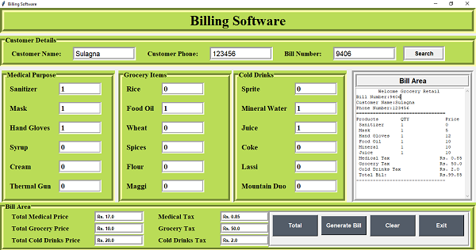

# Billing System:-

<h1>Billing system using Tkinter</h1>

This project can be used for any shops. User can store all the data and generate the bill.

<h2>Tech stack:</h2>

<ul>
    <li>Python</li>
    
</ul>

<h2>Libraries used:</h2>

<ul>
    <li>Tkinter</li>
    <li>Os</li>
    <li>Messagebox</li>
    
</ul>

<h3>To install external modules:</h3>

<ol>Run pip install tkinter</ol>

<h3>To execute the project:</h3>

<ul>Run billing system.py</ul>

<h1><b>Screenshot of this project.</b></h1>

